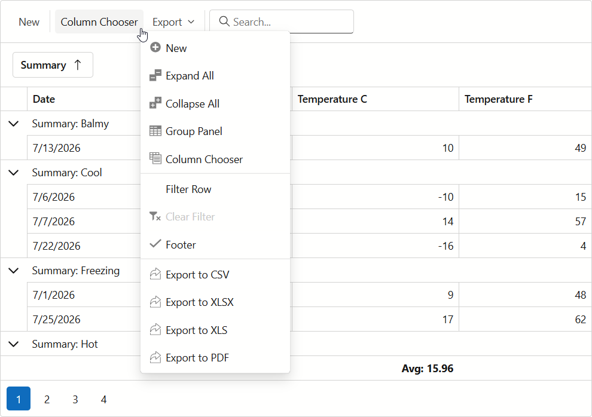

<!-- default badges list -->

<!-- default badges end -->

# Blazor Grid - Customize Context Menu

This repository displays and customizes context menus for various DxGrid areas, customizes their items using DxGrid's built-in APIs, and defines context menus for areas that do not include built-in context menus.

## Implementation Details

### Display Context Menus for All Built-in Areas

Set the [ContextMenus](https://docs.devexpress.com/Blazor/DevExpress.Blazor.DxGrid.ContextMenus) property to `All` to enable DxGrid built-in context menus for the following areas: Header, Footer, Data Row, Group Panel, Group Row, and Group Footer.

File to Review: [Index.razor](./CS/GridWithContextMenu/Pages/Index.razor#L14)

### Customize Context Menu Items Using Grid's Built-in API

DxGrid Component includes built-in APIs to customize context menu items. Follow the steps below to implement them:

1. Add the [oncontextmenu:preventDefault](./CS/GridWithContextMenu/Pages/Index.razor#L14) to disable the standard browser context menu.
2. In the Grid's [CustomizeContextMenu](https://docs.devexpress.com/Blazor/DevExpress.Blazor.DxGrid.CustomizeContextMenu) event handler, subscribe to the **contextmenu** event to display the custom context menu items.

This scenario affects the following DxGrid areas: Header, Footer, and Data Rows.

Files to Review:
* [Index.razor](./CS/GridWithContextMenu/Pages/Index.razor#L64)
* [GridContextMenuHelper.cs](./CS/GridWithContextMenu/Data/GridContextMenuHelper.cs#L298-L365)

### Add Custom Context Menus

The [GridContextMenuContainer](./CS/GridWithContextMenu/Pages/GridContextMenuContainer.razor) component contains Context Menu components. The [GridContextMenuHelper](./CS/GridWithContextMenu/Data/GridContextMenuHelper.cs) class implements Context Menu's item generation, manages state, and includes the click handlers that use the Blazor [Grid's API](https://docs.devexpress.com/Blazor/DevExpress.Blazor.DxGrid._methods) to execute commands. Follow the steps below to display custom context menus:

1. Add the [oncontextmenu:preventDefault](./CS/GridWithContextMenu/Pages/Index.razor#L14) to disable the standard browser context menu.
2. In the Grid's [CustomizeElement](https://docs.devexpress.com/Blazor/DevExpress.Blazor.DxGrid.CustomizeElement) event handler, subscribe to the **contextmenu** event to display the custom Context Menu.

This scenario affects the following application areas: Toolbar Component, DxGrid's Edit Row, and DxGrid's Pager.

Files to Review:
* [Index.razor](./CS/GridWithContextMenu/Pages/Index.razor#L66)
* [GridContextMenuContainer.razor](./CS/GridWithContextMenu/Pages/GridContextMenuContainer.razor#L4-L28)
* [GridContextMenuHelper.cs](./CS/GridWithContextMenu/Data/GridContextMenuHelper.cs#L31-59)

<!--
## Files to Review

- [Index.razor](./CS/GridWithContextMenu/Pages/Index.razor)
- [GridContextMenuHelper.cs](./CS/GridWithContextMenu/Data/GridContextMenuHelper.cs)
- [GridContextMenuContainer.razor](./CS/GridWithContextMenu/Pages/GridContextMenuContainer.razor) -->

## Documentation

- [DxContextMenu](https://docs.devexpress.com/Blazor/DevExpress.Blazor.DxContextMenu)
- [DxGrid](https://docs.devexpress.com/Blazor/DevExpress.Blazor.DxGrid)

## Video

- [Adding a Context Menu to a Grid](https://www.youtube.com/watch?v=TfBR77ARnf8&t)

## More Examples

- [Blazor Data Grid - How to edit/delete the selected row by clicking on external buttons](https://github.com/DevExpress-Examples/blazor-DxDataGrid-edit-selected-row-by-clicking-on-external-button)
<!-- feedback -->
## Does This Example Address Your Development Requirements/Objectives?

 

(you will be redirected to DevExpress.com to submit your response)
<!-- feedback end -->
