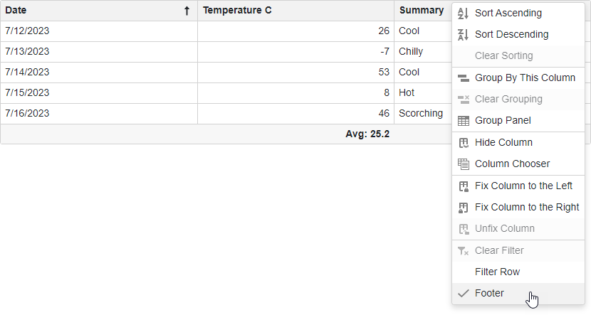

<!-- default badges list -->

<!-- default badges end -->

# Blazor Grid - Show the Context Menu

You can show a Context Menu on a right mouse click on a row or column header.

In the Grid's [CustomizeElement](https://docs.devexpress.com/Blazor/DevExpress.Blazor.DxGrid.CustomizeElement) event handler, subscribe for the **contextmenu** event. The [GridContextMenuContainer](./CS/Pages/GridContextMenuContainer.razor) component contains two Context Menus (for a row and column). The [GridContextMenuHelper](./CS/Data/GridContextMenuHelper.cs) class stores available in the Context Menu options and applies changes to the Grid component.

## Files to Look At

- [Index.razor](./CS/Pages/Index.razor)
- [GridContextMenuHelper.cs](./CS/Data/GridContextMenuHelper.cs)
- [GridContextMenuContainer.razor](./CS/Pages/GridContextMenuContainer.razor)

## Documentation

- [DxContextMenu](https://docs.devexpress.com/Blazor/DevExpress.Blazor.DxContextMenu)
- [DxGrid](https://docs.devexpress.com/Blazor/DevExpress.Blazor.DxGrid)

## More Examples

- [Blazor Data Grid - How to edit/delete the selected row by clicking on external buttons](https://github.com/DevExpress-Examples/blazor-DxDataGrid-edit-selected-row-by-clicking-on-external-button)
